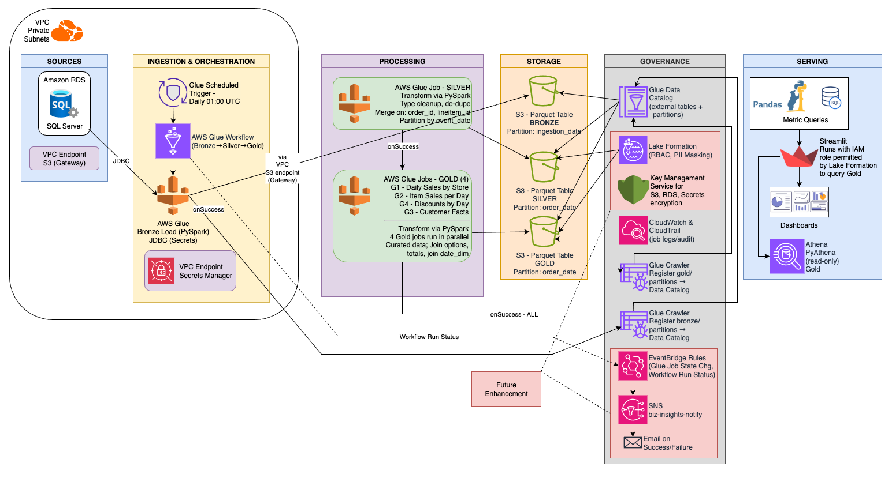

# Business Insights – Analytics Pipeline (Bronze → Silver → Gold)

Daily pipeline that ingests app orders (Bronze), standardizes/dedupes (Silver), aggregates (Gold), and exposes Athena views for dashboards.

---

## At a glance

- **Region:** `us-east-1`  
- **Bucket:** `bus-insights-dev-us-east-1`  
- **Athena Database:** `biz_insights` (workgroup `primary`)
- **Schedule:** 01:00 UTC via Glue Workflow (Scheduled → Bronze → Bronze Crawler → Silver → Gold fan-out → Gold Crawler)

---

## Architecture

**Global Partners/Business Insights - Pipeline Flow**

```mermaid
flowchart LR
  A([RDS SQL Server]) -->|JDBC| B([1. Glue: Bronze])
  B --> SB[(S3 bronze<br>parquet, partition=ingestion_date)]
  B -- onSuccess --> C([2. Bronze Crawler])
  C -- onSuccess --> D([3. Glue: Silver])
  D --> SS[(S3 silver<br>parquet)]
  SS -- onSuccess --> G1([4a. Gold G1])
  SS -- onSuccess --> G2([4b. Gold G2])
  SS -- onSuccess --> G3([4c. Gold G3])
  SS -- onSuccess --> G4([4d. Gold G4])
  G1 --> SG[(S3 gold<br>partitioned writes)]
  G2 --> SG
  G3 --> SG
  G4 --> SG
  SG -- onSuccess (all) --> C2([5. Gold Partitions Crawler])
  C2 --> ATH[[6. Athena Views]] 
  ```

**Detailed Architectural Layout**

[](./docs/screenshots/Business_Insights_Assessement_E2E_Project_3.drawio.png)

## Components

- **Bronze:** Incremental parquet partitioned by `ingestion_date`; no-op success on empty days.
- **Silver:** Typed tables; `order_total`, `order_date`; synthesized `date_dim`; dedupe/guard rails; dynamic partition overwrite.
- **Gold:** 
  - `gold_daily_sales_by_store` (partition: `order_date`)
  - `gold_item_sales_by_day` (partition: `order_date`)
  - `gold_customer_facts` (partition: `snapshot_date`)
  - `gold_discounts_by_day` (partition: `order_date`)

---
## Quick start

### One-time:

- Create the Glue/Athena database (`biz_insights`) and external tables (DDLs under `athena/ddl/`).
- Ensure Glue jobs/crawlers exist and the workflow is wired (see `docs/runbook_daily.md`).

### Run manually:

```
# Start the workflow once
RUN_ID=$(aws glue start-workflow-run --name biz-insights-daily --query RunId --output text --region us-east-1)
aws glue get-workflow-run --name biz-insights-daily --run-id "$RUN_ID" \
  --query 'Run.{Status:Status,StartedOn:StartedOn,CompletedOn:CompletedOn}' --region us-east-1
```

### Check latest job states:

```
for J in bus_insights_ingest_to_bronze biz_insights_silver_build \
         gold_g1_daily_sales_by_store gold_g2_item_sales_by_day \
         gold_g3_customer_facts gold_g4_discounts_by_day; do
  aws glue get-job-runs --job-name "$J" --max-results 1 \
    --query 'JobRuns[0].{Job:JobName,State:JobRunState,Started:StartedOn,Duration:ExecutionTime,Error:ErrorMessage}' \
    --region us-east-1 || echo "Missing: $J"
done
```

### Sanity Check (Athena)

```sql
-- Silver
SELECT MAX(order_date) AS max_dt, COUNT(*) AS rows FROM biz_insights.silver_order_items;
SELECT MIN(date_key), MAX(date_key), COUNT(*) FROM biz_insights.silver_date_dim;

-- Gold
SELECT MAX(order_date), COUNT(*) FROM biz_insights.gold_daily_sales_by_store;
SELECT MAX(order_date), COUNT(*) FROM biz_insights.gold_item_sales_by_day;
SELECT MAX(snapshot_date), COUNT(*) FROM biz_insights.gold_customer_facts;
SELECT MAX(order_date), COUNT(*) FROM biz_insights.gold_discounts_by_day;

-- View example
SELECT MAX(order_date) FROM biz_insights.v_discount_orders_90d;
```

### Reliability guardrails

- Lightweight asserts in jobs (column presence, non-empty outputs, date recency).
- `spark.sql.sources.partitionOverwriteMode=dynamic` + `.repartition(partition_col)` for atomic day writes.
- No-data days: Bronze/Silver exit **successfully** without writes.

### Teardown/cost controls

```bash
# Disable nightly trigger
aws glue stop-trigger --name t_start_bronze --region us-east-1

# Stop RDS
aws rds stop-db-instance --db-instance-identifier bus-insights-sqlserver --region us-east-1

# Remove interface VPC endpoints (keep S3 Gateway)
aws ec2 describe-vpc-endpoints --region us-east-1 --query 'VpcEndpoints[].VpcEndpointId'
# aws ec2 delete-vpc-endpoints --vpc-endpoint-ids vpce-XXXX --region us-east-1
```

### Repo map (short)

- `glue/jobs/` — Glue job sources (Bronze, Silver, G1–G4)
- `athena/ddl/` & `athena/views/` — External tables + view SQL
- `docs/` — Architecture, runbook, screenshots
- `glue/workflow/` & `glue/triggers/` — CLI helpers/scripts

## Recommended visualizations to review

1) **Daily sales trend (overall & by store)**<br>
*Question:* Are sales trending up or down? Any recent anomalies?<br>
*Chart:* Line (date on x, sales on y), optional small-multiples by store.<br>
*Data:* gold_daily_sales_by_store (or view sales_trends_and_seasonality_monthly_by_store.sql).<br>
*Quick SQL:*

```sql
SELECT order_date, SUM(daily_sales) AS sales
FROM biz_insights.gold_daily_sales_by_store
GROUP BY 1 ORDER BY 1;
```

2) **Store leaderboard (latest day)**<br>
*Question:* Which locations lead by revenue/AOV on the latest day?<br>
*Chart:* Bar (store on y, revenue on x), table for AOV & order count.<br>
*Data:* v_store_sales_latest (or location_performance.sql).<br>
*Quick SQL:*<br>

```sql
WITH d AS (SELECT MAX(order_date) AS m FROM biz_insights.gold_daily_sales_by_store)
SELECT store_id, daily_sales, orders_count, aov
FROM biz_insights.gold_daily_sales_by_store t JOIN d ON t.order_date=d.m
ORDER BY daily_sales DESC LIMIT 15;
```

3) **Top items (last 30 days)**<br>
*Question:* What’s selling now? Any new risers?<br>
*Chart:* Horizontal bar (item on y, 30-day sales on x).<br>
*Data:* v_item_sales_30d (or g2_item_sales_by_day.sql).<br>
*Quick SQL:*<br>

```sql
SELECT item_name, SUM(item_sales) AS sales_30d
FROM biz_insights.gold_item_sales_by_day
WHERE order_date >= date_add('day', -30, current_date)
GROUP BY 1 ORDER BY sales_30d DESC LIMIT 20;
```

4) **Discount effectiveness (rolling 90 days)**<br>
*Question:* Do discounts lift revenue or just shift margin?<br>
*Chart:* Dual line (discounted vs non-discounted sales) or stacked bars.<br>
*Data:* v_discount_orders_90d (or pricing_and_discounts_effectiveness.sql).<br>
*Quick SQL:*<br>

```sql
SELECT order_date,
       SUM(CASE WHEN is_discounted THEN order_sales ELSE 0 END) AS discounted_sales,
       SUM(CASE WHEN NOT is_discounted THEN order_sales ELSE 0 END) AS full_price_sales
FROM biz_insights.gold_discounts_by_day
GROUP BY 1 ORDER BY 1;
```

5) **Loyalty impact**<br>
*Question:* How do loyalty orders differ (AOV, frequency)?<br>
*Chart:* Side-by-side bars (loyalty vs non-loyalty), or box/violin for AOV.<br>
*Data:* loyalty_program_impact.sql.<br>
*Quick SQL:*<br>

```sql
SELECT is_loyalty, COUNT(DISTINCT order_id) orders, AVG(aov) avg_order_value
FROM biz_insights.gold_daily_sales_by_store
GROUP BY is_loyalty;
```

6) **Customer segments (RFM / churn risk)**<br>
*Question:* What’s the mix of VIP/High-Value/At-risk customers?<br>
*Chart:* Stacked bar or treemap by segment; table with counts & revenue.<br>
*Data:* gold_customer_facts + customer_segmentation_rfm_loyalty.sql / churn_risk_indicators.sql.<br>
*Quick SQL:*<br>

```sql
WITH s AS (SELECT MAX(snapshot_date) d FROM biz_insights.gold_customer_facts)
SELECT segment_label, COUNT(*) customers,
       SUM(lifetime_gross_sales) revenue
FROM biz_insights.gold_customer_facts
WHERE snapshot_date IN (SELECT d FROM s)
GROUP BY 1 ORDER BY customers DESC;
```

7) **Seasonality & holidays**<br>
*Question:* Which days/months/holidays punch above their weight?<br>
*Chart:* Heatmap (weekday × month), or bar by holiday.<br>
*Data:* sales_trends_and_seasonality_monthly_by_category.sql, sales_trends_and_seasonality_holiday.sql.<br>
*Quick SQL:*<br>

```sql
SELECT month(order_date) m, day_of_week, SUM(daily_sales) sales
FROM biz_insights.gold_daily_sales_by_store
JOIN biz_insights.silver_date_dim ON date_key=order_date
GROUP BY 1,2 ORDER BY 1,2;
```

Tip: for demos, filter to last 30/90 days and highlight the latest day to show the end-to-end freshness.
